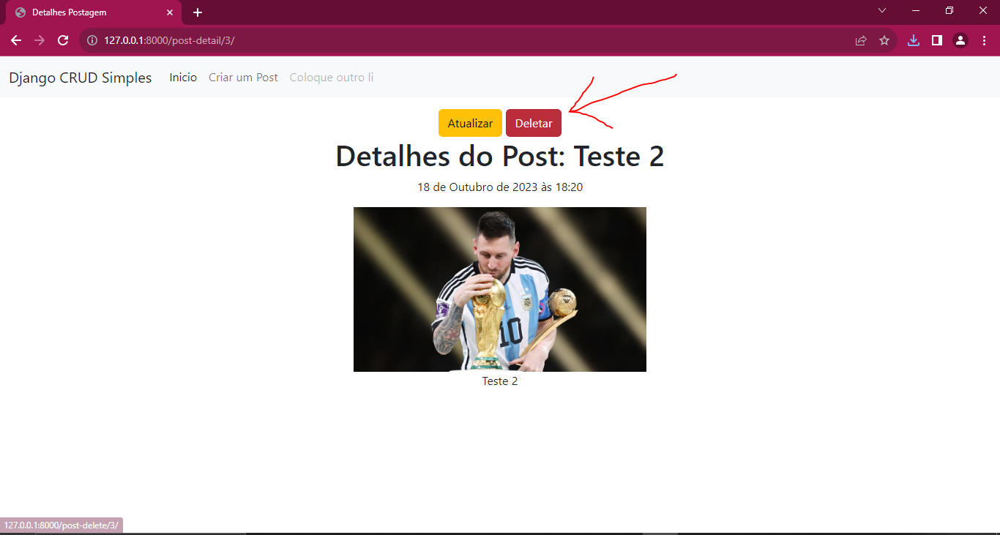

# Django CRUD ESTILO blog

Neste repositorio foi feito um CRUD simples, a qual adquiri os conhecimentos em um curso do youtube.

<h2>CREATE</h2>
Criando uma postagem no Blog

Preenchendo o formulario: 

Postagem Criada com Sucesso! ✔️

<h2>READ</h2>
Ao Clicar em VER, podemos ver a postagem e READ

<h2>UPDATE</h2>
Ao clicar em Verm podemos atualizar também: 

BOMMMM...ATUALIZAMOS

<h2>DELETE</h2>
Ao clicar em VER, logo depois em Deletar.

CREATE
READ
UPDATE
DELETE

FEITOS!✔️✔️✔️✔️
